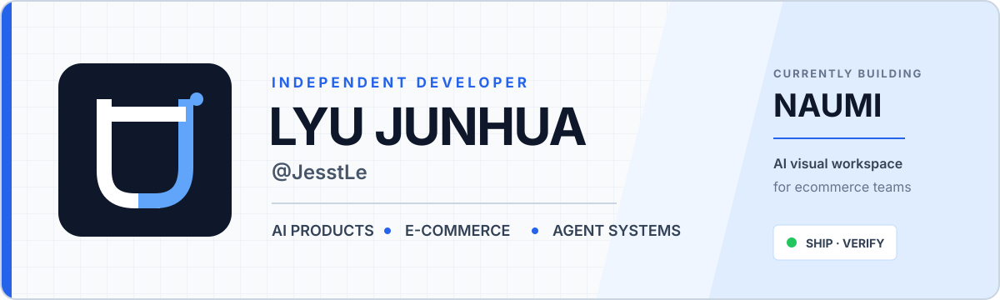

  

  <b>独立开发者 · AI 产品 · 电商系统 · Agent 基础设施</b> 
  把想法做成真正可部署、可计费、可持续运行的产品。

## 01 / Currently shipping

<table>
  <tr>
    <td width="68%" valign="top">
      FLAGSHIP PRODUCT
      <h2>NAUMI</h2>
      
<b>AI 电商视觉生产力工作站。</b>

      
从文生图、图生图和商品套图，到图像工具、血缘式无限画布、多用户计费与自部署；让视觉资产从一次性生成，变成可追踪、可复用的生产流程。

      
<code>Next.js</code> <code>TypeScript</code> <code>PostgreSQL</code> <code>Docker</code>

    </td>
    <td width="32%" valign="top">
      SYSTEM SIGNAL
      
<b>STATUS</b> <code>SHIPPING</code>

      
<b>FOCUS</b> AI × COMMERCE

      
<b>METHOD</b> DESIGN → CODE → DEPLOY

    </td>
  </tr>
</table>

## 02—05 / Open systems

| No. | Project | What it does | Core |
|:---:|:---|:---|:---|
| **02** | **[OpenKnowledge](https://github.com/JesstLe/OpenKnowledge)** | 本地智能知识管理：RAG 问答、文档管理与语义搜索 | <code>TypeScript</code> <code>RAG</code> |
| **03** | **[OpenSynapse](https://github.com/JesstLe/OpenSynapse)** | 面向 AI 应用的统一工作台与系统化能力探索 | <code>TypeScript</code> <code>AI</code> |
| **04** | **[X Bookmarks → Obsidian](https://github.com/JesstLe/x-bookmarks-to-obsidian)** | 将 X 书签、图片和视频完整同步进 Obsidian | <code>JavaScript</code> <code>Obsidian</code> |
| **05** | **[NaumiAgent](https://github.com/JesstLe/NaumiAgent)** | Naumi 的 Agent 服务运行时与任务执行基础设施 | <code>Python</code> <code>Agent</code> |

## 06 / Applied builds

<table>
  <tr>
    <td width="50%" valign="top">
      BUSINESS SYSTEM
      <h3><a href="https://github.com/JesstLe/erp">ERP ↗</a></h3>
      
面向通用业务场景的开源企业资源管理系统。

      
<code>C#</code> <code>Enterprise</code>

    </td>
    <td width="50%" valign="top">
      RESEARCH SYSTEM
      <h3><a href="https://github.com/JesstLe/quant-agent">Quant Agent ↗</a></h3>
      
LLM 驱动的量化研究、回测和风险分析 Agent。

      
<code>Python</code> <code>LLM</code> <code>Backtesting</code>

    </td>
  </tr>
</table>

## Build surface

<pre>
PRODUCT      TypeScript · Next.js · Node.js
SYSTEMS      Python · Go · FastAPI
DATA         PostgreSQL · RAG · event pipelines
DELIVERY     Docker · observability · recovery loops
</pre>

## Activity

  

  <b>Build useful things. Make them last.</b> 
  <a href="https://github.com/JesstLe?tab=repositories">Repositories</a>
  &nbsp;/&nbsp;
  <a href="mailto:lv1335765788@gmail.com">Email</a>

