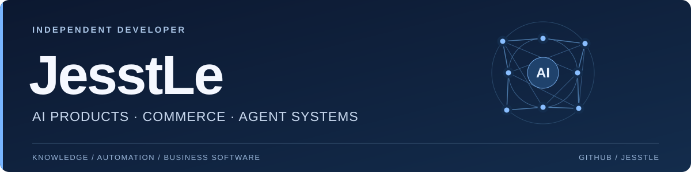

  

  <strong>独立开发者 · AI 产品 · 电商系统 · Agent 基础设施</strong> 
  构建面向真实业务的 AI 产品，专注知识管理、Agent 工作流与电商系统。

  <a href="#当前产品">当前产品</a> ·
  <a href="#代表项目">代表项目</a> ·
  <a href="https://github.com/JesstLe?tab=repositories">全部仓库</a> ·
  <a href="mailto:lv1335765788@gmail.com">联系我</a>

## 当前产品

### NAUMI · AI 电商视觉工作站

面向电商视觉素材生产，整合文生图、图生图、商品套图、图像工具与无限画布，将生成结果组织成可追踪、可复用的工作流程。支持多用户计费与自部署。

Next.js · TypeScript · PostgreSQL · Docker

## 代表项目

### [OpenKnowledge](https://github.com/JesstLe/OpenKnowledge) · 本地知识管理

通过文档导入、RAG 问答与语义搜索，把本地资料转化为可检索、可对话的知识库；支持多种模型提供商。

Next.js · TypeScript · FastAPI · PostgreSQL / pgvector

### [OpenSynapse](https://github.com/JesstLe/OpenSynapse) · AI 学习与知识连接

将 AI 对话、笔记提炼、间隔重复复习与知识图谱串联起来，支持自托管与多设备访问。

React · TypeScript · PostgreSQL · Chroma · D3.js

### [门店 ERP](https://github.com/JesstLe/erp) · 连锁门店经营管理

围绕预约接待、会员、收银、库存和经营分析组织业务流程，支持品牌内多门店共享、品牌间数据隔离与操作审计。

C# / ASP.NET Core · React · TypeScript · PostgreSQL

### [NaumiAgent](https://github.com/JesstLe/NaumiAgent) · 本地 Agent

面向阅读、执行、记忆与协作的本地 Agent 系统，提供终端交互、工具执行、多模型路由与会话恢复。

Python · Node.js · SQLite · Chroma · LiteLLM

## 更多实践

- **[X Bookmarks → Obsidian](https://github.com/JesstLe/x-bookmarks-to-obsidian)** — 将 X 书签正文、图片与视频保存到 Obsidian，并修复历史笔记中的链接和媒体引用。JavaScript · Browser automation
- **[Task Nexus Pro](https://github.com/JesstLe/Task_NeXus_Pro)** — 面向 Windows 游戏场景的 CPU 调度、进程管理与内存优化工具。Tauri · React · Rust

## 技术与工程

**产品开发** · TypeScript、React、Next.js、Node.js  
**后端与数据** · Python、FastAPI、C# / ASP.NET Core、PostgreSQL、向量检索  
**交付与运行** · Docker、自部署、权限控制、审计与恢复

---

欢迎围绕 AI 产品、知识管理、Agent 工具与业务系统交流。

[浏览项目](https://github.com/JesstLe?tab=repositories) · [邮件联系](mailto:lv1335765788@gmail.com)
